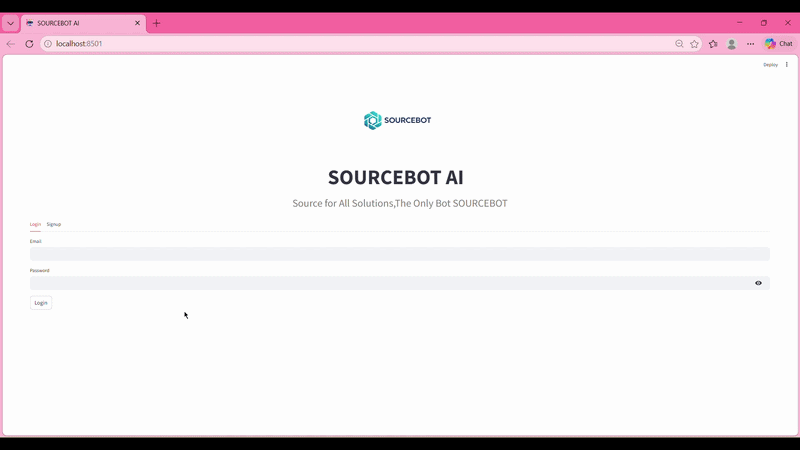
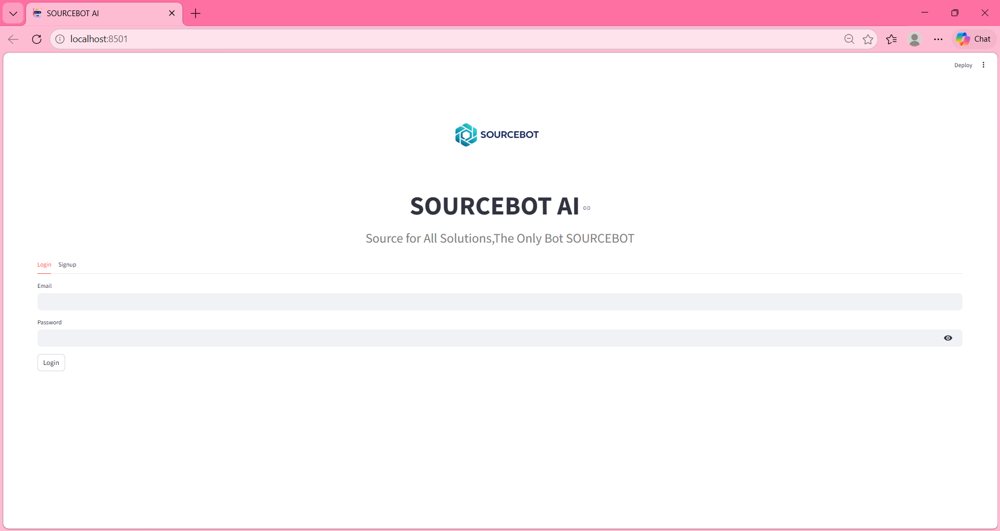
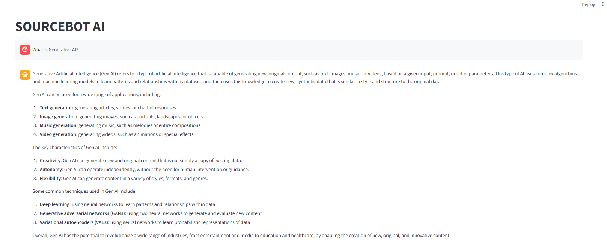
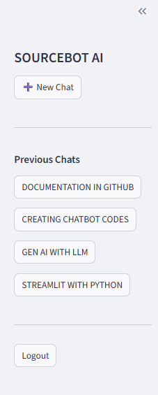

# 🤖 SOURCEBOT AI – Generative AI Chatbot

SOURCEBOT AI is a **Generative AI-powered chatbot** built using **Python, Streamlit, and Groq LLM APIs**.  
The system allows users to **sign up, log in, interact with an AI assistant, and revisit previous conversations** using persistent chat history.

This project demonstrates **real-world Generative AI application architecture**, including **LLM integration, authentication systems, chat memory, database storage, and modern AI UI design.**

---

# 🎥 Live Demo



The demo shows:

- User authentication
- AI-powered question answering
- Chat history storage
- Sidebar conversation retrieval

---

# 🚀 Features

### 🔐 User Authentication
- Secure **Login / Signup**
- Password hashing
- User session management

### 🧠 AI Chatbot
- Powered by **Groq LLM API**
- Natural language understanding
- Supports **technical and general knowledge questions**

### 💬 Conversation Memory
- Chat history stored in database
- Sidebar showing previous chats
- Users can reopen earlier conversations

### 📊 Database
- SQLite database
- SQLAlchemy ORM
- User-specific chat storage

### 🎨 User Interface
- Built with **Streamlit**
- Centered chatbot layout
- Sidebar navigation
- Auto-scroll chat messages

---

# ⚙️ Tech Stack

| Technology | Purpose |
|-----------|--------|
| **Python** | Core programming language |
| **Streamlit** | Web application framework |
| **Groq API** | LLM inference for chatbot responses |
| **SQLite** | Lightweight database |
| **SQLAlchemy** | ORM for database management |
| **HTML/CSS** | UI styling |

---

# 🧠 System Architecture

```
User
 │
 ▼
Streamlit Interface
 │
 ▼
Authentication System
 │
 ▼
Chat Manager
 │
 ▼
Groq LLM API
 │
 ▼
AI Response Generation
 │
 ▼
Database Storage (SQLite)
```

### Components

- **Streamlit UI** – Chat interface and user interaction  
- **Authentication Module** – Handles login and signup  
- **Chat Manager** – Controls conversation flow  
- **Groq Client** – Sends prompts to LLM API  
- **Database Layer** – Stores users and chat history  

---

# 📸 Application Screenshots

### 🔐 Login Page



---

### 🤖 Chat Interface



---

### 📂 Previous Chat Sidebar



---

# 🏗️ Project Structure

```
sourcebot-ai
│
├── app.py
├── config.py
├── requirements.txt
├── .env
├── .gitignore
│
├── auth
│   ├── auth_utils.py
│   ├── login.py
│   └── signup.py
│
├── chatbot
│   ├── chat_manager.py
│   ├── groq_client.py
│   └── memory.py
│
├── database
│   ├── db.py
│   └── models.py
│
├── ui
│   ├── chat_ui.py
│   ├── login_ui.py
│   └── sidebar.py
│
├── static
│   └── logo.png
│
├── screenshots
│   ├── login_page.png
│   ├── chat_interface.png
│   └── sidebar_history.png
│
├── demo
    └── demo.gif


```

---

# 🔑 Environment Variables

Create a `.env` file in the project root:

```
GROQ_API_KEY=your_groq_api_key_here
```

This ensures API keys are **not exposed in GitHub repositories**.

---

# 📦 Installation

Clone the repository

```
git clone https://github.com/22AD040/sourcebot-ai.git
cd sourcebot-ai
```

Create virtual environment

```
python -m venv venv
```

Activate environment

Windows

```
venv\Scripts\activate
```

Mac/Linux

```
source venv/bin/activate
```

Install dependencies

```
pip install -r requirements.txt
```

---

# ▶️ Run the Application

Start the Streamlit server

```
streamlit run app.py
```

Open the app in your browser

```
http://localhost:8501
```

---

# 🔒 Security Best Practices

Never upload the following files to GitHub:

```
.env
venv/
data/users.db
__pycache__/
*.pyc
```

Add them to `.gitignore`.

---

# 👩‍💻 Author

**Ratchita B**

Generative AI Developer  
Machine Learning Enthusiast  

---

# 📜 License

This project is licensed under the **MIT License**.